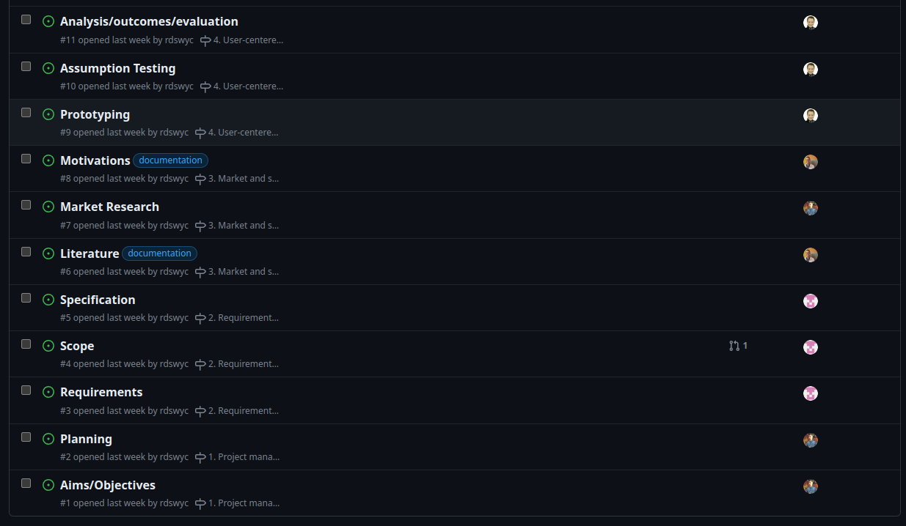
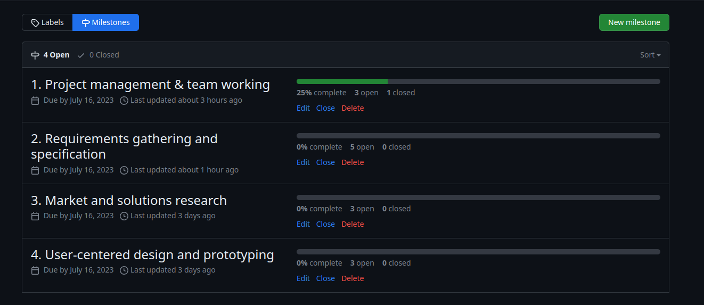
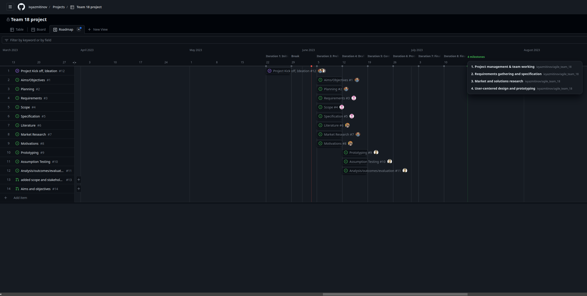

# Planning

## Tools

In order to plan our work we employed:

- [Google Spreadsheets](https://docs.google.com/spreadsheets), for draft planing and gathering information
- [GitHub Issues and Project](https://github.com/features/issues), to manage tasks and timelines

## Process

We plan our activities considering those basic factors:

1. Our team has vast gaps in programming experience
2. We are limited by two hard deadlines: the project proposal and final project.
    
After the introduction and ideation stages we agreed on the set of deliverables for the project proposal.
For every deliverable there was created a task and assigned a team member:

Those tasks were also added to the milestones, with a hard deadline date set according to the project proposal
deadline:

We agreed to implement our tasks iteratively, in a two weeks sprints. Those sprints consist of two phases, each
phase takes a week: the investigation phase, and the prototyping stage.

During the investigation stage we perform research, study feedback, and create or adjust our specification for the
project. In the next stage we create prototype designs from new specifications or update existing designs to
address incoming feedback.

At the end of each iteration we plan our tasks for the next one.

It should also be noted that, while the workload was distributed among team members, it is not strict, and any team member
is able to ask for assistance in case some unexpected issues arise.